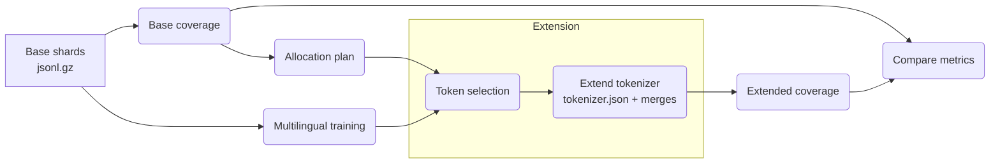

## Tokenizer extension pipeline
The tokenizer-extension package automates coverage analysis, allocation scoring, multilingual tokenizer training, vocabulary extension, and post-extension coverage/comparison for a set of `.jsonl.gz` language shards.

### What happens when you run the pipeline?
1. **Base coverage (`coverage.py`)** — reads every `*.jsonl.gz` from `base_data_dir`, tokenizes each shard with the base tokenizer, and writes `base_metrics.csv` with chars/token, pieces/word, and unknown-rate metrics.
2. **Allocation (`allocation.py`)** — scales the base metrics, applies the weights and `gamma` from the config, and produces `allocation.csv` describing how many new tokens each language should get (`token_alloc`).
3. **Multilingual training (`training.py`, optional)** — if `train_multilingual: true`, trains a new tokenizer from the shard texts (iterator over the gzipped JSONL files) and saves it under `trained_tokenizer/`.
4. **Extension (`extension.py`)** — loads the base tokenizer and the trained multilingual tokenizer, samples per-language documents (`extension_sample_docs` per shard), keeps the highest-frequency tokens absent from the base vocab, and merges them into `extended_tokenizer/` with merge rules filtered to avoid invalid merges. Allocation drives how many tokens per language are selected.
5. **Extended coverage (`coverage.py`, optional)** — re-runs coverage on the same shards but with `extended_tokenizer/`, writing `extended_metrics.csv`.
6. **Comparison (`pipeline.py` / `pipeline_slurm.py`)** — joins base vs. extended coverage tables and tracks per-language deltas in `comparison.csv`.



### Running locally
```bash
python -m tokenizer_extension.pipeline --config data_prep/tokenizer_extension/configs/cola_tier1_12langs.yaml
```
- Pass multiple `--config` values to run several tiers back-to-back.
- Override the output root via `TOKENIZER_EXTENSION_OUTPUT_DIR=/path/to/run python -m ...`.

### SLURM-ready entry points
- `run_pipeline_slurm.sh [CONFIG]` — single job that runs every stage sequentially via `srun`. The script now accepts an explicit config path or defaults to `configs/cola_tier1_12langs.yaml`; logs land in `logs/tokenize_extension/`.
- `run_all_tokenizer_extensions.sh` — submits three jobs (tier1/2/3) that each invoke the SLURM script above so tokenizer training/extending happens for every sampled data tier.
- `run_pipeline_staged.sh CONFIG` — advanced helper that submits each stage as its own job using `pipeline_slurm.py --stage ...` and waits between submissions; useful when the cluster requires per-stage resource tuning.

### Expectations on the input data
- `base_data_dir`, `train_data_dir`, `extension_data_dir`, and `extended_data_dir` all point at directories with `language.jsonl.gz` shards produced by `sample_data/run_all_samplers.sh`.
- Every JSON line must contain the text key referenced by `*_text_key` (defaults to `text`).
- Extension currently samples documents inside each shard (`extension_sample_docs`) and does **not** regenerate candidate token lists elsewhere, so the JSON data itself must represent the curated sample set for the tokenizer tier.

## Open TODOs
1. Adapt the extension stage to handle larger shards more efficiently (currently loads/tokenizes `extension_sample_docs` per language in Python).
2. Add end-to-end CI-style validation to exercise the full pipeline automatically.
3. Integrate automatic extraction of per-language candidate tokens from raw data instead of assuming curated JSONL shards already exist.
