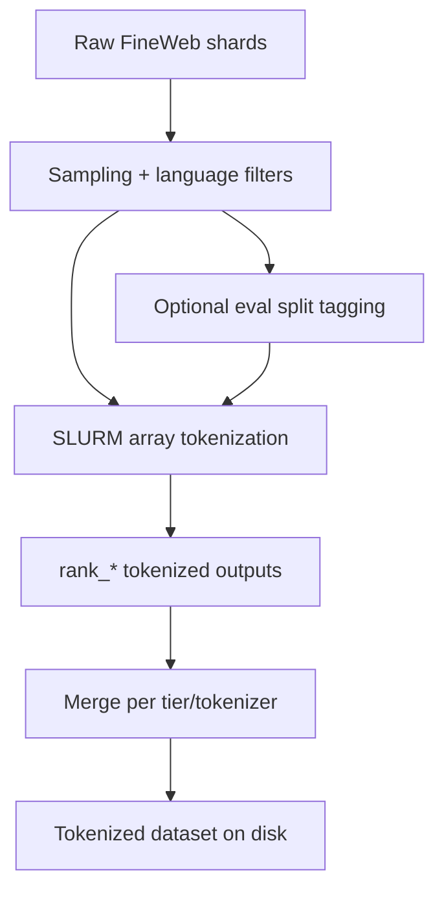

# Data Preparation

This section explains the **concepts and decisions** behind how data is sampled, clustered, tokenizer-extended, and tokenized into training-ready datasets. File paths are linked for implementation details.

---

## 1) Base Corpus and Language Metadata
- **Primary source**: FineWeb / FineWeb2-derived multilingual shards (see `data_prep/` and analysis notebooks under `data_prep/base_data/`).
- **Language metadata**: each record must carry a language field (used for routing and evaluation). The tokenization pipeline reads this via `LANGUAGE_COLUMN`.
- **Relevant files**:
  - `data_prep/base_data/fineweb2_language_analysis.ipynb`
  - `docs/language_selection_requirements.md`

---

## 2) Language Selection and Clustering
Before sampling data we had to decide **which languages to include**. After a lot of discussion we decided to only include languages with **enough available documents**, otherwise we do not have enough data to train effectively on some languages.
This is commonly used in other research (e.g., Glot500), where they only include languages with a minimum document threshold. See `docs/extra/dataset_creation_reasoning.md` and `docs/extra/decide_token_budget.md` for the references and rationale.
Reference: https://aclanthology.org/2023.acl-long.61/

Another reason for this choice is evaluation coverage: this includes most languages supported by the **FLORES** and **Belebele** benchmarks, which are the biggest and most important multilingual benchmarks for us. Therefore we train mostly on languages where we can evaluate results not only on eval loss but on real benchmarks.

After selecting languages we derive **language clusters**. The reason is that similar languages can be trained together and benefit from cross‑lingual transfer. We group languages using Uriel and lang2vec representations (https://aclanthology.org/E17-2002/). We base our analysis on genetic language distances and cluster languages based on that.

### 2.1 Analysis + clustering notebook
The analysis and two‑stage clustering can be found here:
- `approaches/CoLA/tools/two_stage_clustering/language_family_tree_based.ipynb`

Why this clustering? Our architecture is based on **asymmetric low‑rank adaptation**. Prior work (CoLA and LoRA variants) shows that combining **shared A matrices** with **multiple B heads** helps A learn shared patterns while B learns language‑specific features. We want to use this: for each language group/family, A should learn shared patterns, and B heads should learn specific languages/patterns.
Therefore we use **multiple experts and sub‑experts**, derived via two‑stage clustering based on language distances.

### 2.2 Tier Groupings (Expert Clusters + Subgroups)
These JSONs define expert groups and optional subgroups used by CoLA/Hydra routing.

- `tools/two_stage_clustering/12_tier_language_groupings.json`
- `tools/two_stage_clustering/72_tier_language_groupings.json`
- `tools/two_stage_clustering/200_tier_language_groupings.json`

Each grouping entry can include:
- `languages`: members of the expert cluster
- `subgroups`: optional subgroup lists (used for per-language heads)
- `metadata`: optional extra info

Once we have selected the languages we can now sample data for all of them. But how?
---

## 3) Sampling Strategy (Why and How)

Data distribution is important for training. Should we keep the original distribution? Oversample or undersample low/high‑resource languages?
We decided to use an established, research‑proven method for this:

### 3.1 Alpha-Smoothing (alpha = 0.3)
We rebalance language distributions using alpha-smoothing to avoid overfitting to high-resource languages.

- **Definition**:
  - `w_lang = n_lang ^ alpha`
  - `p_lang = w_lang / sum_j w_j`
  - `budget_lang = total_budget * p_lang`
- **Chosen alpha**: `0.3` (standard in multilingual training).
- **References**: XLM-R, mT5, mDAPT, Glot500 (see `docs/decide_token_budget.md`).
This is well‑established; the major multilingual papers use this strategy, therefore we follow it.

### 3.2 Token Budgets from Throughput
Instead of fixed dataset sizes, we derive **tier-level token budgets** from observed throughput and target walltime. This makes the pipeline match actual cluster constraints.

- **Reference**: `docs/decide_token_budget.md`
- **Key idea**: use empirical tokens/sec/GPU (not theoretical FLOPs) to set total tokens per tier (12/72/200/etc.).

### 3.3 High‑scale data sampling
We highly suggest using Datatrove (https://github.com/huggingface/datatrove) for sampling at scale since it supports highly distributed sampling.
Our implementation can be found in `approaches/CoLA/sample_data/`.

---

## 4) Tokenizer Extension
We extend the base tokenizer per tier to improve multilingual coverage.
Main idea: we measure metrics such as **pieces per word (PPW)** and **characters per token (CPT)** for each language. We set a tokenizer extension budget (how many tokens we add). Based on the main budget we split this across languages. Languages that perform worse in PPW/CPT get more tokens. We extend by adding the most frequent tokens that are **not** in the current vocab.
We then extend the embedding layer and initialize new weights by averaging the subtoken weights from the original vocab.

- **Code**: `data_prep/merlin_data_prep/tokenizer_extension/`
- **Entry points**:
  - `data_prep/merlin_data_prep/tokenizer_extension/ReadMe.md`
  - `data_prep/merlin_data_prep/tokenizer_extension/scripts/run_pipeline_slurm.sh`
  - `data_prep/merlin_data_prep/tokenizer_extension/scripts/run_pipeline_staged.sh`

---

## 5) Tokenization Pipeline (SLURM Arrays + Storage)
After sampling data, it is stored in huge `jsonl.gz` files. We suggest first splitting each language into manageable parts. Use `approaches/CoLA/data_prep/merlin_data_prep/distributed_data_processor/src/shard_python.py` which splits data into shards (max ~512MB).
Then tokenization becomes manageable and fast per shard.

Our Tokenization runs as a **SLURM array**, one rank per shard group, followed by a merge step. Sampling and language filters are applied before saving tokenized datasets.

### 5.1 Core Scripts
- `data_prep/merlin_data_prep/distributed_data_processor/scripts/tokenize_and_merge_pipeline.sh`
- `data_prep/merlin_data_prep/distributed_data_processor/src/tokenize_slurm.py`

### 5.2 High-Level Flow
Install mermaid chart support to visualize this:

### 5.3 Data format
We store data in a Hugging Face `DatasetDict`‑compatible format so it is easy to load during training.
We adapted `approaches/CoLA/LLaMA-Factory/src/llamafactory/data/loader.py` to load large‑scale tokenized datasets and read the eval split.

### 5.4 Eval data handling
Eval data is part of the created tokenized dataset directory. During tokenization, a configurable fraction (default 2%) is labeled as eval data. This eval/train split is then loaded in `approaches/CoLA/LLaMA-Factory/src/llamafactory/data/loader.py`.
You can check the eval split creation in `approaches/CoLA/data_prep/merlin_data_prep/distributed_data_processor/src/tokenize_slurm.py`, which is the main SLURM‑scalable tokenization script we use for all large‑scale adapter trainings.
---

## 6) Validation and Sanity Checks
- **Tokenized output verification**:
  - `data_prep/merlin_data_prep/distributed_data_processor/src/verify_tokenized_outputs.py`

---

## 7) Implementation Pointers (If You Need Details)
If you need exact CLI flags or per-language keep-rate mechanics, see:
- `data_prep/merlin_data_prep/distributed_data_processor/scripts/tokenize_and_merge_pipeline.sh`
- `data_prep/merlin_data_prep/distributed_data_processor/scripts/moe/build_language_rates_from_budget.sh`
- `docs/decide_token_budget.md`
