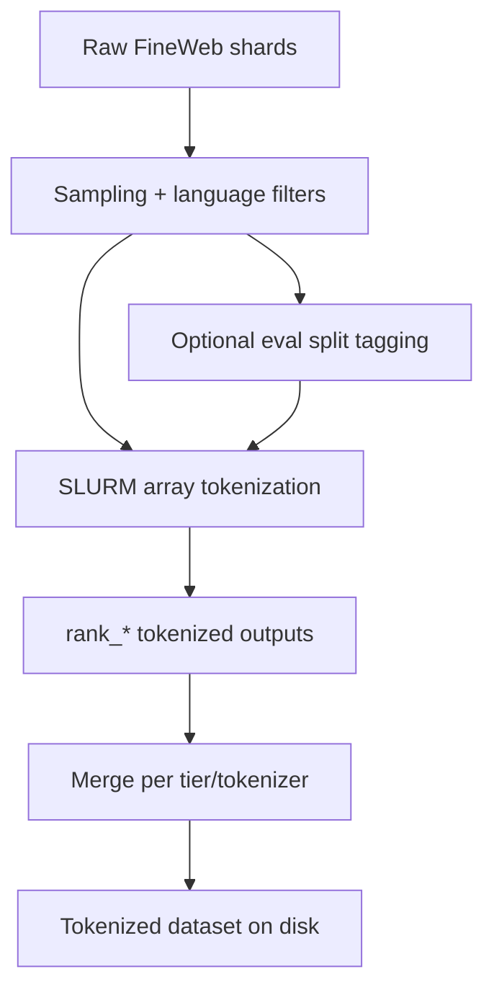

# Data Preparation

This section explains the **concepts and decisions** behind how data is sampled, clustered, tokenizer-extended, and tokenized into training-ready datasets. File paths are linked for implementation details.

---

## 1) Base Corpus and Language Metadata
- **Primary source**: FineWeb / FineWeb2-derived multilingual shards (see `data_prep/` and analysis notebooks under `data_prep/base_data/`).
- **Language metadata**: each record must carry a language field (used for routing and evaluation). The tokenization pipeline reads this via `LANGUAGE_COLUMN`.
- **Relevant files**:
  - `data_prep/base_data/fineweb2_language_analysis.ipynb`
  - `docs/language_selection_requirements.md`

---

## 2) Sampling Strategy (Why and How)
### 2.1 Alpha-Smoothing (alpha = 0.3)
We rebalance language distributions using alpha-smoothing to avoid overfitting to high-resource languages.

- **Definition**:
  - `w_lang = n_lang ^ alpha`
  - `p_lang = w_lang / sum_j w_j`
  - `budget_lang = total_budget * p_lang`
- **Chosen alpha**: `0.3` (standard in multilingual training).
- **References**: XLM-R, mT5, mDAPT, Glot500 (see `docs/decide_token_budget.md`).

### 2.2 Token Budgets from Throughput
Instead of fixed dataset sizes, we derive **tier-level token budgets** from observed throughput and target walltime. This makes the pipeline match actual cluster constraints.

- **Reference**: `docs/decide_token_budget.md`
- **Key idea**: use empirical tokens/sec/GPU (not theoretical FLOPs) to set total tokens per tier (12/72/200/etc.).

---

## 3) Language Selection and Clustering
### 3.1 Language Lists
- **Guidelines**: `docs/language_selection_requirements.md`

### 3.2 Tier Groupings (Expert Clusters + Subgroups)
These JSONs define expert groups and optional subgroups used by CoLA/Hydra routing.

- `tools/two_stage_clustering/12_tier_language_groupings.json`
- `tools/two_stage_clustering/72_tier_language_groupings.json`
- `tools/two_stage_clustering/200_tier_language_groupings.json`

Each grouping entry can include:
- `languages`: members of the expert cluster
- `subgroups`: optional subgroup lists (used for per-language heads)
- `metadata`: optional extra info

---

## 4) Tokenizer Extension
We extend the base tokenizer per tier to improve multilingual coverage.

- **Code**: `data_prep/merlin_data_prep/tokenizer_extension/`
- **Entry points**:
  - `data_prep/merlin_data_prep/tokenizer_extension/ReadMe.md`
  - `data_prep/merlin_data_prep/tokenizer_extension/scripts/run_pipeline_slurm.sh`
  - `data_prep/merlin_data_prep/tokenizer_extension/scripts/run_pipeline_staged.sh`

---

## 5) Tokenization Pipeline (SLURM Arrays + Storage)
Tokenization runs as a **SLURM array**, one rank per shard group, followed by a merge step. Sampling and language filters are applied before saving tokenized datasets.

### 5.1 Core Scripts
- `data_prep/merlin_data_prep/distributed_data_processor/scripts/tokenize_and_merge_pipeline.sh`
- `data_prep/merlin_data_prep/distributed_data_processor/src/tokenize_slurm.py`

### 5.2 High-Level Flow

### 5.3 Where Tokenized Data Lives
- Tokenized datasets are stored under:
  - `${TOKENIZED_BASE_DIR}/<tokenizer_dir>/<tier_suffix>`
- Training scripts reference these paths directly (see `scripts/comparison/*.sh`).

---

## 6) Validation and Sanity Checks
- **Tokenized output verification**:
  - `data_prep/merlin_data_prep/distributed_data_processor/src/verify_tokenized_outputs.py`

---

## 7) Implementation Pointers (If You Need Details)
If you need exact CLI flags or per-language keep-rate mechanics, see:
- `data_prep/merlin_data_prep/distributed_data_processor/scripts/tokenize_and_merge_pipeline.sh`
- `data_prep/merlin_data_prep/distributed_data_processor/scripts/moe/build_language_rates_from_budget.sh`
- `docs/decide_token_budget.md`

